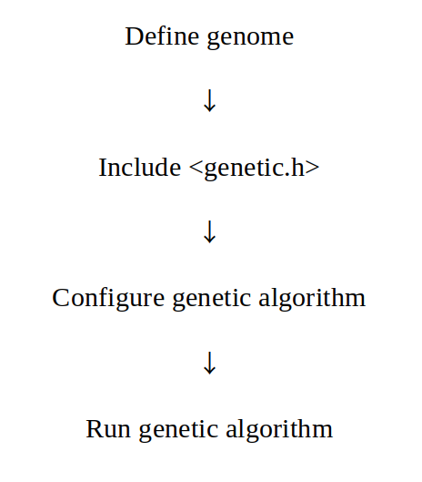

# genetic-algorithm (C++17)
This is a genetic algorithm library. It supports an abstract and open-ended interface.

# Getting Start

First, make the static library `libgenetic.a` or `genetic.lib`.
```
$ git clone https://github.com/asuka1975/genetic-algorithm.git
$ cd genetic-algorithm
$ cmake .
$ make
```
Then, put completed binary file on library directory of your project and put header files on include directory.

# Overview
## Alogorithm flow


## Define genome
If crossover(TGenome, TGenome) is defined, any type with any structure can behave as a genome.

Following example, std::string behave as a genome.

```c++
namespace genetic {
    std::string crossover(const std::string&, const std::string&) {
        return std::string{};
    }
}
```

## Include `<genetic.h>`
You can use all of functions in genetic-algorithm by including `<genetic.h>`. 
Be careful! a place where crossover is user-defined must be before `#include <genetic.h>`.

## Configure genetic algorithm
Look at following code.
```c++
ga_config<std::string> config; /* you can set more template parameters */
config.population = 20;
config.epoch = 200;
config.fitness_max = 1.0f;
config.fitness_min = 0.0f;
config.select = roulet{};
config.step = /* describe task */;
config.scale = [](float x) { return x; };
config.initializer = /* every individual initialization */;
config.mutates.push_back(std::make_pair(0.01f, /* every individual mutation */));
config.node_mutates.push_back(std::make_pair(0.01f, /* every node of individual mutateion */));
```

## Run genetic algorithm
Look at following code.
```c++
ga<std::string> g(config);
config.run();
```
If you want to observe evolutionary process, set config.callback to user-defined function.

# Reference
## genome

You can make a class which behavior as genome. 
However, the class which can behavior as genome should be copy-assignable, copy-construcitible, default-constructible and `crossover` invokable 

The function `crossover` should have a signature as follows.

```c++
class TGenome {
public:
    static TGenome crossover(const TGenome&, const TGenome&);
};
```

for example,

```c++
#include <string>
#include <genetic.h>
class string_genome {
public:
    string_genome crossover(const string_genome& d1, const string_genome& d2) {
        string_genome d = d1;
        for(int i = 0; i < d.data.size(); i++) {
            if(i < d.data.size() / 2) d.data[i] = d2.data[i];
        }
        return d;
    }
private:
    std::string data;
}
``` 

## ga_config
Ga_config means a configuration of genetic algorithm. It has 11 member variables and a member type.

### member types
|name|explanation|
|:---:|:---|
|individual_t|mean a tuple which has genomes|

### member variables
|name|type|explanation|
|:---:|:---:|:---|
|population|std::uint64_t|the number of individuals in an initial state|
|epoch|std::uint64_t|the number of generations|
|fitness_max|float|maximum possible value of fitness|
|fitness_min|float|minimum possible value of fitness|
|callback|std::function<void>(const std::vector<individual_t>&, const std::vector\<float\>&)|always called every time learning of one generation has finished|
|select|std::function<std::vector<individual_t>(const std::vector<individual_t>&, const std::vector<float>&)>|generate and select new individuals from old individuals by fitness values|
|step|std::function<std::vector<float>(const std::vector<individual_t>&)>|individuals do task|
|scale|std::function<float(float)>|change scale of fitness value|
|initializer|std::function<individual_t()>|initialize per one individual|
|mutates|std::vector<std::pair<float, std::function<void(individual_t&)>>>|have a pair of a probability and mutate function of genome|
|node_mutates|std::vector<std::pair<float, std::function<void(float, individual_t&)>>>|if a genome has a structure which mean a kind of container, have a pair of a probability and mutate function of per node of a genome|

## ga
Ga is a class which execute genetic algorithm. It has one member function and one member type.

### member type
|name|explanation|
|:---:|:---|
|individual_t|the same as individual_t in ga_config|

### member function
|name|explanation|
|:---:|:---|
|run|main loop of genetic algorithm|